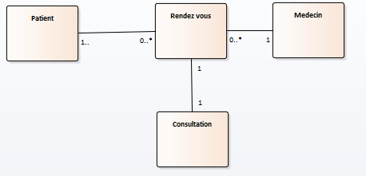
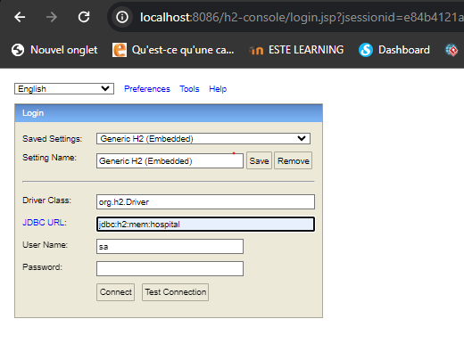
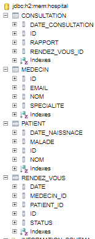
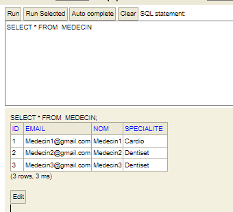
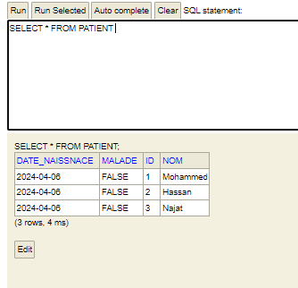
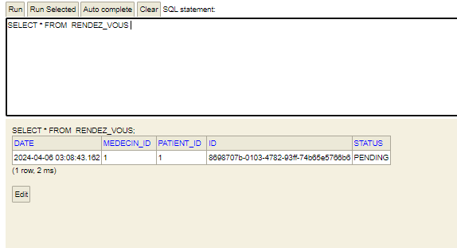
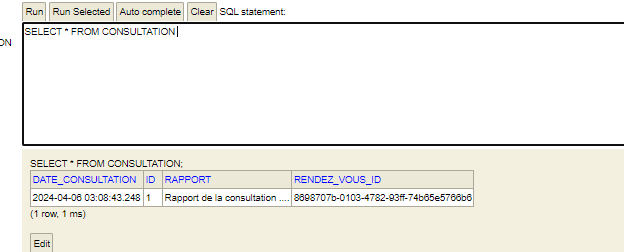
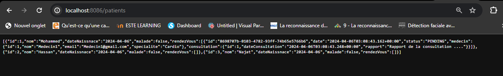

<h1>Compte rendu de l'activité Pratique N° 2 : ORM JPA HIbernate Spring Data Exemple de patient medecin RendezVous </h1>
Grami salma 
<h3>Introduction</h3>

Au cours de ce TP, nous allons apprendre à modéliser et à gérer des relations entre différentes entités dans une application Spring Boot. Nous allons explorer les différentes annotations fournies par Spring Data JPA pour définir ces relations et comprendre comment elles sont mappées dans la base de données.

 
<h3>Enonce</h3>

Refaire l'exemple pour savoir comment se comporter avec les differents associations des tables .

<h3>Conception</h3>

 

<h3>Captures ecran </h3>

Créer les entites  JPA Patient ,medecin,rendez vous et consultation dans H2 

H2 Database est une base de données temporaire souvent utilisée 
pour les tests, où les données peuvent être ajoutées et manipulées 
pendant la session, mais sont supprimées une fois la connexion terminée.
L'accès à la base de données se fait via le lien localhost/h2-console. 

 
 

Creation de la table medecin avec quelques donnees 

  
Creation de la table patient avec quelques donnees 

  

Creation de la table rendez vous  avec les donnees existantes de patient et medecin 

À l'aide des données existantes des médecins et des patients, nous avons créé un rendez-vous et l'avons lié à une consultation en utilisant les relations entre les tables. Par exemple, en utilisant les clés étrangères dans la table des rendez-vous pour référencer le médecin et le patient concernés, ainsi que d'autres informations pertinentes telles que la date et l'heure de la consultation. Cette approche permet de maintenir l'intégrité des données et de faciliter la gestion des rendez-vous et des consultations dans notre système.

  

Une consultation est liee aun rendez vous : 

La classe UUID nous aide à générer des clés uniques selon le système, par exemple, lorsque nous utilisons UUID.randomUUID().toString() pour définir l'identifiant de chaque rendez-vous avant de l'enregistrer dans la base de données en utilisant rendezVousRepository.save(rendezVous). Cela garantit l'unicité de chaque clé, ce qui est essentiel pour éviter les conflits d'identifiants dans notre système.

 
 

Afficher les donnees dans web service

 
 

Pour éviter les boucles causées par les relations bidirectionnelles entre les tables, nous avons ajouté des restrictions telles que @JsonProperty(access=JsonProperty.Access.WRITE_ONLY). Par exemple, pour afficher les patients avec leur liste de rendez-vous sans afficher le nom du patient existant dans la classe RendezVous, nous utilisons une seule direction d'affichage, en excluant l'information redondante.

<h3>Conclusion</h3>

En conclusion, ce TP nous a permis de maîtriser les relations One-to-One, One-to-Many et Many-to-One dans Spring Boot. Grâce à des exercices pratiques, nous avons acquis une compréhension solide de la modélisation des données et de l'utilisation efficace des annotations de Spring Data JPA. Nous sommes désormais prêts à appliquer ces connaissances dans nos projets pour développer des applications robustes et bien structurées.

